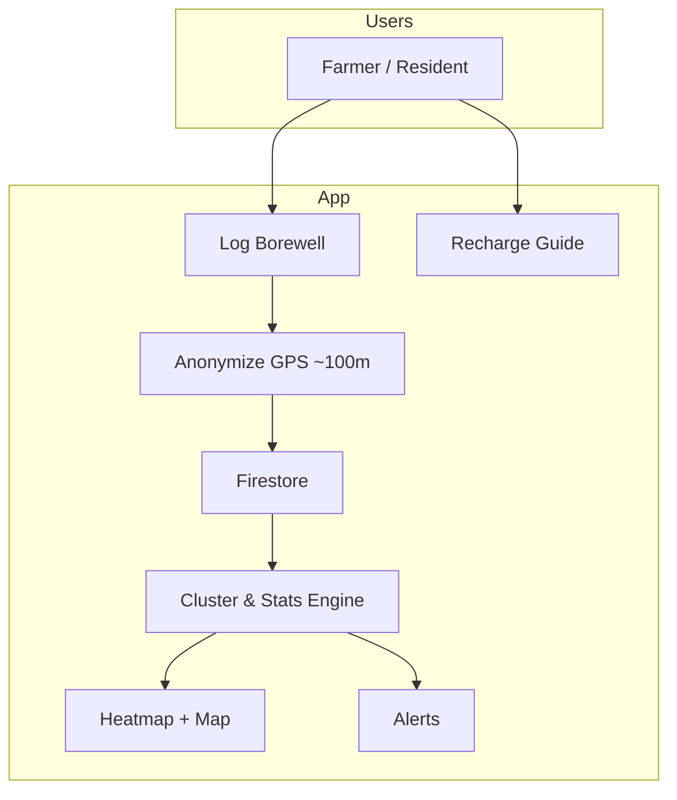

# Anthar-Jala Watch

<p align="center">
  <strong>💧 Anthar-Jala Watch</strong>
</p>

<p align="center">
  <strong>A community borewell monitor for groundwater awareness</strong><br/>
  Crowdsourced water-table insights for farmers and residents in rural India
</p>

<p align="center">
  
  
  
  
  
</p>

---

## The problem

Groundwater (*Anthar-Jala*) levels are falling across many regions. Most farmers and homeowners only discover their borewell is failing when it is already too late. There is rarely a **shared picture** of water-table health in a village—making it hard to plan usage, avoid unnecessary new borewells, and invest in **recharge** instead of only extraction.

**Anthar-Jala Watch** turns invisible groundwater into a visible, community-managed resource.

---

## The vision

Anthar-Jala Watch is a **Community Borewell Monitor**: a crowdsourced water-table map where users log borewell depth and yield. The app aggregates readings into a **water stress heatmap** for the neighborhood, helping communities decide when to conserve water and when to start recharge activities—before summer peaks cause failures.

---

## Features

### Borewell logging
- Record **water depth** (feet), **yield** (inches/hour), and **year of digging**
- **GPS-based location** with automatic privacy rounding (~100 m precision)
- Animated **vertical depth scale** for intuitive reading entry
- Data synced to **Cloud Firestore** for community aggregation

### Water stress map
- Interactive **Google Maps** view centered on your village
- **Heatmap layer** (green → yellow → red) reflecting local water stress
- **Marker clustering** for grouped borewell readings
- Live **village statistics**: average yield, average depth, critical wells, total logs
- **Cluster averages** computed per GPS area (~100 m grid)

### Smart alerts
- Notifications-style **alerts screen** for your area
- Detects **seasonal water-table drops** (e.g. 10+ ft between reading periods)
- Flags **moderate** and **critical** stress zones based on community yield data
- Badge count on the dashboard when new alerts are active

### Borewell recharge guide
- Step-by-step **DIY recharge structures**:
  - Percolation pit
  - Recharge trench / channel
  - Sand filter chamber
- Simple **vector diagrams** for each technique

### Privacy by design
- Exact house locations are **never stored**
- Coordinates are rounded to **3 decimal places** (~100 m) before upload
- Clear in-app privacy messaging for contributors

### Authentication
- Email/password sign-up and login
- **Google Sign-In** integration
- Village selection during registration (e.g. Sirsi, Banavasi, Bhairumbe, Hulekal)

---

## Tech stack

| Layer | Technology |
|--------|------------|
| Language | Kotlin |
| UI | Jetpack Compose, Material 3 |
| Architecture | MVVM (`ViewModel` + Repository) |
| Navigation | Navigation Compose |
| Backend | Firebase Auth, Cloud Firestore |
| Maps | Google Maps SDK, Maps Compose, Heatmap API |
| Location | Google Play Services Location |
| Build | Gradle (Kotlin DSL), KSP |

---

## How it works



1. A user logs depth, yield, year dug, and location.
2. Location is rounded for privacy, then saved to Firestore.
3. Readings are grouped into GPS clusters; averages and stress levels are calculated.
4. The map heatmap and village stats update from community data.
5. Alerts are generated when stress or seasonal depth drops exceed thresholds.

---

## Getting started

### Prerequisites

- **Android Studio** Ladybug (2024.2+) or newer recommended
- **JDK 11+**
- Android device or emulator with **Google Play Services**
- A [Firebase](https://console.firebase.google.com/) project
- A [Google Cloud](https://console.cloud.google.com/) project with **Maps SDK for Android** enabled

### 1. Clone the repository

```bash
git clone https://github.com/Wafee17/AntharJalaWatch.git
cd AntharJalaWatch
```

### 2. Firebase setup

1. Create a Firebase project and add an **Android app** with package name:
   ```
   com.example.anthar_jalawatch
   ```
2. Download `google-services.json` and place it in:
   ```
   app/google-services.json
   ```
3. Enable **Authentication** (Email/Password and Google).
4. Create a **Cloud Firestore** database (test or production mode).
5. Enable **Google Sign-In** and add your Web client ID for Credential Manager.

### 3. API keys (`local.properties`)

In the project root, create or edit `local.properties` (this file is git-ignored):

```properties
sdk.dir=C\:\\Users\\YourName\\AppData\\Local\\Android\\Sdk
MAPS_API_KEY=your_google_maps_api_key
WEB_CLIENT_ID=your_firebase_web_client_id.apps.googleusercontent.com
GEMINI_API_KEY=your_gemini_api_key_optional
```

| Key | Purpose |
|-----|---------|
| `MAPS_API_KEY` | Google Maps & Heatmap layer |
| `WEB_CLIENT_ID` | Google Sign-In (OAuth 2.0 Web client from Firebase) |
| `GEMINI_API_KEY` | Reserved for future AI features |

> Never commit `local.properties` or API keys to GitHub.

### 4. Firestore rules (example for development)

Adjust for production. Example permissive rules for student/demo use:

```javascript
rules_version = '2';
service cloud.firestore {
  match /databases/{database}/documents {
    match /users/{userId} {
      allow read, write: if request.auth != null && request.auth.uid == userId;
    }
    match /borewells/{docId} {
      allow read: if request.auth != null;
      allow create: if request.auth != null;
    }
  }
}
```

### 5. Build and run

```bash
./gradlew assembleDebug
```

Or open the project in Android Studio and click **Run**.

Grant **location permission** when logging a borewell so readings appear on the community map.

---

## Project structure

```
app/src/main/java/com/example/anthar_jalawatch/
├── data/
│   ├── models/          # Borewell, User, WaterAlert, WaterCluster
│   └── repository/      # Auth & Firestore access
├── navigation/          # App routes & NavHost
├── ui/
│   ├── components/      # Heatmap, depth indicator
│   ├── screens/         # Dashboard, Log, Alerts, Recharge, Auth
│   └── theme/           # Material 3 dark theme
├── util/                # Location, clustering, alerts
└── MainActivity.kt
```

---

## App navigation

| Screen | Route | Description |
|--------|-------|-------------|
| Splash | `splash` | Branded launch |
| Login / Sign up | `login`, `signup` | Authentication |
| Dashboard | `dashboard` | Map, heatmap, village stats |
| Log borewell | `log_borewell` | Submit a reading |
| Recharge guide | `recharge` | DIY recharge steps |
| Alerts | `alerts` | Community water alerts |

---

## Impact goals

- **Water sustainability** — shift from individual extraction to community management  
- **Disaster prevention** — surface stress before peak summer  
- **Resource awareness** — make groundwater visible and actionable  

---

## Configuration

| Setting | Value |
|---------|--------|
| Min SDK | 24 (Android 7.0) |
| Target SDK | 36 |
| Package | `com.example.anthar_jalawatch` |

---

## Contributing

Contributions are welcome. To propose a change:

1. Fork the repository  
2. Create a feature branch (`git checkout -b feature/amazing-feature`)  
3. Commit your changes (`git commit -m 'Add amazing feature'`)  
4. Push to the branch (`git push origin feature/amazing-feature`)  
5. Open a Pull Request  

---

## License

This project was developed as part of an **Android App Development using GenAI** coursework module (Natural Resources — Anthar-Jala Watch).  

Specify your license here if you publish publicly, for example:

```
MIT License — see LICENSE file for details.
```

---

## Acknowledgements

- Inspired by the **Anthar-Jala Watch** project specification (community borewell monitoring for groundwater sustainability)
- Built with [Jetpack Compose](https://developer.android.com/jetpack/compose), [Firebase](https://firebase.google.com/), and [Google Maps Platform](https://mapsplatform.google.com/)

---

<p align="center">
  <sub>Made with care for villages facing falling water tables — Sirsi, Banavasi, and beyond.</sub>
</p>
